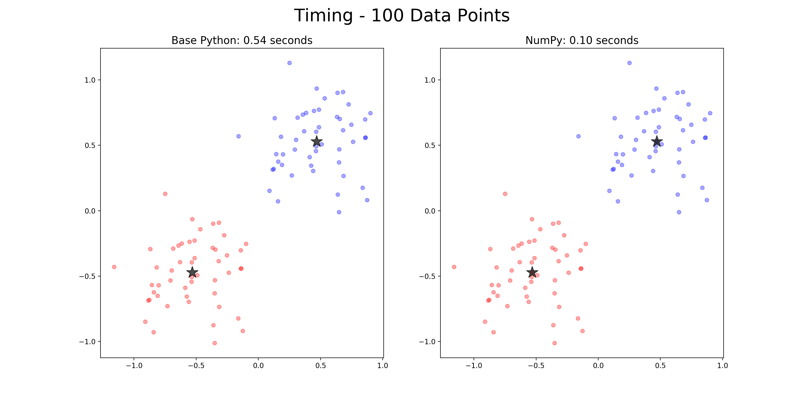
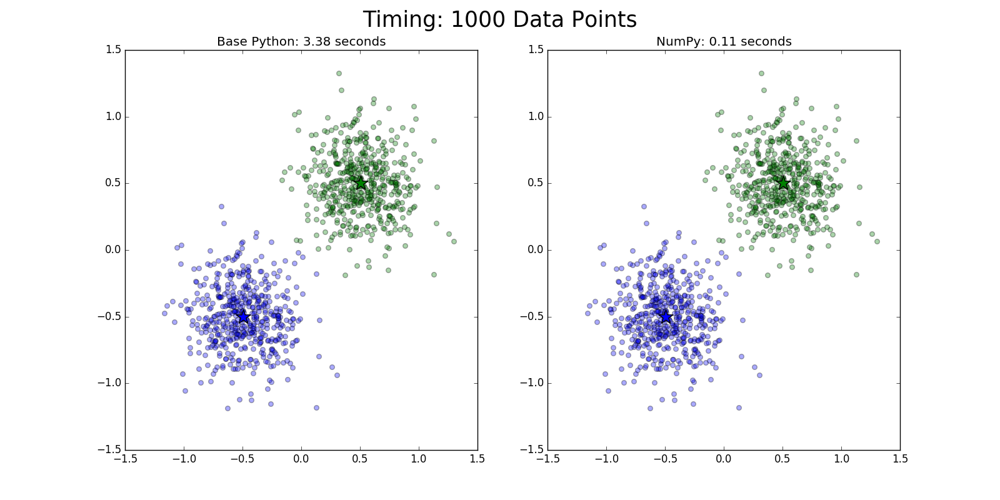
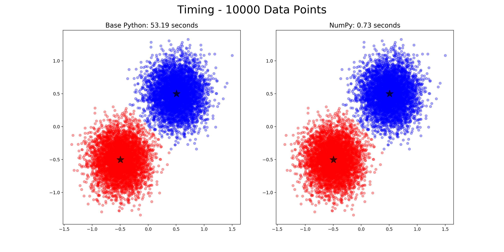

# An Introduction to Numeric Computing in Python

This repository aims to serve as a tutorial style introduction to discovering numeric performance optimizations in the Python programming language. It assumes only a cursory knowledge of Python and a tolerance for pinches of math. Requisite Python libraries to run the included code are: `scipy`, `numpy`, and `matplotlib`.

## Table of Contents:
1. [Preamble](#preamble)
2. [NumPy](#numpy)
    * [Duck Typing Limitations](#duck-typing-limitations)
    * [Broadcasting](#broadcasting)
3. [k-means](#k-means)
    * [Why k-means](#why-k-means)
    * [Pseudocode](#pseudocode)
    * [Implementations](#implementations)
        1. [Base Python](#base-python)
        2. [NumPy Accelerated](#numpy-accelerated)
        3. [Comparison](#comparison)
4. [Just the Beginning](#just-the-beginning)

## Preamble

Python is well known to be an incredible learning language for beginning programmers on account of its readability, intuitive syntax, and wonderful community.

What many people don't know about Python when they unknowingly choose it from a stack of languages based on what programming language the internet suggests a beginner start with is that Python has a vast array (no pun intended) of other amazing features, libraries, and applications; many more in fact than a beginner could even begin to guess.

A short, but far from exhaustive, list of fantastic Python offerings to whet your technical palate (**Note:** All of these libraries are open source):
* [Django](https://www.djangoproject.com/) - web development.
* [Selenium-Python](http://selenium-python.readthedocs.io/) - web browser automation.
* [SciPy](https://www.scipy.org/) - scientific computing.
* [Scikit-Learn](http://scikit-learn.org/stable/) - machine learning.
* [Tensorflow](https://www.tensorflow.org/) - tensor graph computation library from Google, nuff said.

It is through a specific library within the SciPy ecosystem that this tutorial will introduce programming performant Python. That library is [NumPy](http://www.numpy.org/).

## NumPy

NumPy's front page defines itself as the following:

> NumPy is the fundamental package for scientific computing with Python. It contains among other things:
> * a powerful N-dimensional array object
> * sophisticated (broadcasting) functions
> * tools for integrating C/C++ and Fortran code
> * useful linear algebra, Fourier transform, and random number capabilities

These are amazing features indeed if we're looking for a library to add some performance to our Python code.

As this repository intends simply to introduce NumPy we will be focusing on the first two bullet points, N-dimensional arrays and broadcasting functions. We should, however, take a moment to talk about some of the intuitions for when and why we can expect performance gains from NumPy; part of this is closely tied to Python's limitations.

### Duck Typing Limitations

So we have some intuition for one of the reasons using NumPy might give us faster code let's discuss type systems for a moment.

Python is colloquially referred to a duck typed language, deriving from thr phrase now known as the duck test, "If it looks like a duck, swims like a duck, and quacks like a duck, then it probably is a duck." You might be wondering, how in the world is this saying applicable to programming, aka, what's all this quack about?

In Python, since it's an interpreted language, when you type the command `4 + 5` it doesn't __*know*__ what 4 and 5 are so it has to go check to see if you can add them together. As it turns out, you can, so Python will return `9` of type integer since that was the type of the two numbers we started with.

Python is always checking if you can perform the requested operation in real time. And this is part of what makes Python programming a delight. For example, if you want to do something in a `while` loop until a list, `ex_list`, is empty you could write `while len(ex_list) >= 0`. However, we can use duck typing to our advantage and instead write `while ex_list`. This works because Python knows `while` needs a boolean, so it will silently try to interpret `ex_list` as one; luckily a list only evaluates to `False` when it is empty, which is exactly what we want!

There is, however, a downside to duck typing. It incurs a time penalty; read: it can be slow sometimes. One of those times is when you're looping over numbers and performing numeric operations on them. Even if you have a list only containing numbers, to add 2 to every one of those numbers you'll need to loop over the list and add 2 to every number separately. Each time though, Python will need to manually check if it can, is allowed to, add 2 to that element of the list.

```python
>>> [i + 2 for i in [1, 2, 3, 4, 5, 6]]
[3, 4, 5, 6, 7, 8]
```

While much of the slowness in the above "add 2 to all the elements of a list" example can be attributed to duck typing pitfalls, we can see another aspect of the situation as the limiting the nature of a Python list. Since Python lists are heterogeneous, this manual check for the ability to add a number to it's elements is actually necessary. Is there a different data structure, then, that could alleviate this pain point?

### Broadcasting

NumPy is going to be our saving grace when it comes to escaping the time expensive processing of duck checking. As we saw above in NumPy's self description, it provides "a powerful N-dimensional array object". By definition, at least in the C programming language which is the language Python and NumPy are written in, an array is an ordered, and therefore, indexable group of variables of the same type. This sounds just like a Python list, until we get to the part about having the same type. Another way to put it is that arrays are homogeneous.

It is this homogeneity that allows NumPy to run much faster than base Python. Consider the following intuitive extension of the above add 2 example. If, instead, we use a NumPy array, the array will already know that all of it's elements are numbers -- it has to because it's homogeneous -- therefore it won't need to check if it can add 2 to any of them, it knows it can!

In fact, in many situations, like the add 2 one above, we won't even need to write a loop to perform our operation! "How is possible?", you ask. Through the magic of the second feature of NumPy listed above, [broadcasting](https://docs.scipy.org/doc/numpy/user/basics.broadcasting.html).

Broadcasting, also known as vectorization, provides a way to express operations over an entire array instead of having a manually loop over every individual element. Let's see this applied to our add 2 example in a picture then in code.

<div style="text-align: center"></div>

All NumPy does when you try to add a single number to an array is infer that you want to add it to every individual element of the array. The really cool thing about this is that NumPy doesn't actually make an array full of 2s. Instead it actually performs the exact same loop we saw above, but it does it behind the scenes in C instead of Python.

We can see an equivalence of these two interpretations in the following code block. **Note:** The first one is actually faster because we don't have to move between copies of 2.

```python
>>> np.array([1, 2, 3, 4, 5, 6]) + 2
array([3, 4, 5, 6, 7, 8])
>>> np.array([1, 2, 3, 4, 5, 6]) + np.array([2, 2, 2, 2, 2, 2])
array([3, 4, 5, 6, 7, 8])
```

One final thing to note about broadcasting is that many of NumPy's functions, beyond just built-in operations, can be broadcast. We'll be seeing this and broadcasting in higher dimensions later in the tutorial. If you'd like to know more about broadcasting click the above link to NumPy's documentation.

Now let's look at an algorithm, k-means, to serve as a medium for observing a need for NumPy and then its power.

## k-means

[k-means](https://en.wikipedia.org/wiki/K-means_clustering) is an unsupervised machine learning algorithm designed to discover clusters within a dataset. Consider the following, highly math-less description, of k-means; algorithm/math/English junkies, please forgive me.

    Try to find the centers of blobs of that already "exist" within a dataset.

The following image, hopefully in the more intuitive visual way, demonstrates what is meant by "centers" and "blobs".

<div style="text-align: center"></div>

**Note:** In practice these "blobs" exist in a space with many more than two dimensions. The above plot and the rest in this tutorial are presented in 2 dimensions solely as a device to gain intuition for what we're trying to accomplish with k-means.

### Why k-means

It's worth mentioning that k-means is a great algorithm to introduce numeric Python optimizations with since it is both fairly straightforward and has a visually demonstrable result. In addition, it's simplest implementation isn't overly complicated in either base Python or with NumPy.

In order to stay on the rails and keep chugging towards learning about injecting performance into Python and not detour deep into machine learning algorithms...ville, let's move on to pseudocode and then implementations of the k-means algorithm.

### Pseudocode

For some context of how k-mean finds the "center" of the "blobs" here's a rough pseudocode outline of the algorithm.

1. Initialize centroids. Aka, choose `k` centroids to start from.
2. While stopping condition not met:
    1. Find closest centroid to each point.
    2. Move centroids to the average of all the points closest to them.

### Implementations

**Note:** The code blocks throughout the remainder of this tutorial will not include doc strings to cut down on unnecessary space usage. Also, because code blocks will be accompanied by explanations. However, doc strings are important! As such, they are obviously included in the actual scripts which are located in the `src` directory.

First we're going to to look at a k-means implementation using only built-in Python functions and data structures.

#### Base Python

This k-means implementation lives under the name `base_python` in the `kmeans.py` script in the `src` directory. At the top level, we see a code outline mirroring the pseudocode above. The `k` centroids are initialized to the first `k` data points, and the stopping condition is set to be a fixed number of iterations. **Note:** There are better ways to do both of these things, the method here was chosen to boil the algorithm to it's simplest form.

```python
def base_python(X, k, iterations=1000):
    centroids = X[:k]
    for _ in range(iterations):
        centroid_assignments = get_new_assignments(centroids, X)
        calculate_new_centroids(centroids, centroid_assignments)
    return centroids, centroid_assignments
```

The meat of `base_python`, however, is implemented in two functions: `get_new_assignments` and `calculate_new_centroids` corresponding to steps 2.1 and 2.2, respectively, in the pseudocode above. Let's look at both now.

##### Getting New Centroid Assignments

```python
def get_new_assignments(centroids, X):
    centroid_assignments = [[] for _ in centroids] # <------------------------ Part 1
    for data_point in X: # <-------------------------------------------------- Part 2
        closest_dist = 1e100
        closest_centroid = None
        for centroid_idx, centroid_location in enumerate(centroids): # <------ Part 3
            current_dist = list_euclidean_dist(centroid_location, data_point)
            if current_dist < closest_dist:
                closest_dist = current_dist
                closest_centroid = centroid_idx
        centroid_assignments[closest_centroid].append(data_point)
    return centroid_assignments
```

The above function, which finds the closest centroid to each data point given the current centroids and all of the data, has 3 main parts, following are their explanations:

1. initialization of the centroid assignments list,
2. a loop over all the data points,
3. a nested loop over all the centroids.

The first part makes an empty list of lists. Corresponding by index, each of these inner lists will hold the data points that make up a centroid's "blob".

The second part initializes variables `closest_dist` and `closest_centroid` to be updated by the inner loop discussed in part three. Once the inner loop is complete and the closest centroid discovered for a data point, that data point is appended to the list in `centroid_assignments` corresponding to it's `closest_centroid` index.

The third part loops over all of the centroids updating the closest one if the current centroids distance is less than the closest centroid it's seen so far. To calculate distance it uses the function `list_euclidean_dist`. Here is its code:

```python
def list_euclidean_dist(a, b):
    return sum((da - db) ** 2 for da, db in zip(a, b)) ** 0.5
```

Nothing fancy, just looking at each dimension in two list and taking the square root of the sum of their squared differences.

##### Finding New Centroids

```python
def calculate_new_centroids(centroid_assignments):
    for idx, centroid_assignment in enumerate(centroid_assignments): # <------ Part 1
        centroid = [] # <----------------------------------------------------- Part 2
        for dim in zip(*centroid_assignment): # <----------------------------- Part 3
            centroid.append(sum(dim) / len(dim))
        centroids[idx] = centroid 
```

This function which takes the output of `get_new_assignments`, a list of lists of data points closest to that centroid, one for each centroid, also has three main parts:

1. a loop over all the centroid assignment lists,
2. initialize a new list to hold the values of a single new centroid,
3. a nested loop over the dimensions of the data points, finding the average value for each.

Parts 1 and 2 are pretty self-explanatory; part 3, though has some slightly shifty things going on. Much of this shiftiness happens in the `for dim in zip(*centroid_assignment)`. In case you haven't encountered it before, the `*` before an iterable "unpacks" it. What this means is that all the lists, here data points, in `centroid_assignment` are pulled apart; when they are immediately zipped back together all of the first elements of the original lists are grouped together, then the second ones, etc.

Let's look at a toy example so we can "see" what's going on:

```python
>>> centroid_assignment = [[1, 2], [3, 4], [5, 6]]
# => *centroid_assignment looks like [1, 2] [3, 4] [5, 6] as separate entities
>>> zip(*centroid_assignment)
[(1, 3, 5), (2, 4, 6)]
```

Given this, our for loop is looping over the dimensions of the data points, getting all the values for each dimension of the data points closest to that centroid, one at a time. Once we have this, to find the average value in this dimension we simply sum the values and divide by the number of them. Each full list describing a new centroid location is immediately stored in the passed centroids list at the appropriate index.

You can see an example result of this method by running `python demo.py --base` at the command line. The demo script can be found in the `src` directory. Running the demo script with the "base" flag will produce a `matplotlib` plot with two data blobs. The blobs are colored by the centroids that k-means discovered and marked as stars.

#### NumPy Accelerated

The NumPy version of this algorithm is going to take advantage of broadcasting to speed things up. The broadcasting used is slightly more advanced than the example above, but each place it's used the intuition behind what's going on will be explained.

As for the k-means algorithm, the NumPy version still follows the outline laid out in the pseudocode above. Here it is again so you don't have to scroll back up.

1. Initialize centroids. Aka, choose `k` centroids to start from.
2. While stopping condition not met:
    1. Find closest centroid to each point.
    2. Move centroids to the average of all the points closest to them.

Another benefit of broadcasting is that it leads to less code since we won't be writing out explicit for loops. With that in mind, here is the entirety of the k-means algorithm, this time assuming that, the data points, `X`, are in a NumPy array.

```python
from scipy.spatial.distance import cdist
import numpy as np

def numpy(X, k, iterations=1000):
    centroids = X[:k] # <----------------------------------------------------- Part 1
    for _ in range(iterations): # <------------------------------------------- Part 2
        closest_centroid_idxs = cdist(X, centroids).argmin(axis=1) # <-------- Part 2.1
        for idx in range(k): # <---------------------------------------------- Part 2.2
            centroids[idx] = np.mean(X[closest_centroid_idxs == idx], axis=0)

    centroid_assignments = make_centroid_assignments(X, closest_centroid_idxs)
    return centroids, centroid_assignments

def make_centroid_assignments(X, closest_idxs):
    return [X[closest_idxs == idx] for idx in np.unique(closest_idxs)]
```

As we saw above the first two parts are very straightforward in this bare-bones version of k-means. The real work is being done in parts 2.1 and 2.2. The last function, `make_centroid_assignments` is simply a convenience function to make the same style centroid assignments list as we had in the base Python version.

##### Part 2.1 - Finding Closest Centroid to Each Data Point

A benefit of NumPy that has only been mentioned in passing up until now is the fact that it's part of the SciPy ecosystem. This ecosystem has many other libraries that are designed to integrate tightly with NumPy. The code above uses a function from one of these libraries, [`cdist`](https://docs.scipy.org/doc/scipy/reference/generated/scipy.spatial.distance.cdist.html#scipy.spatial.distance.cdist), from SciPy's [`spatial.distance`](https://docs.scipy.org/doc/scipy/reference/spatial.distance.html#module-scipy.spatial.distance) module.

This function, `cdist` does about half the heavy lifting of part 2.1. It computes the distance between all the pairs that can be made from our data, `X`, and the current centroids. **Note:** If you follow the link to `cdist` above, the documentation specifies that it is expects two NumPy arrays as input. The call to `cdist(X, centroids)` then is expected to return a NumPy array with the same number of rows as are in `X` and columns as there are centroids. Let's look at an example:

```python
>>> X = np.array([[1, 2], [3, 4], [5, 6]])
>>> centroids = np.array([[0, 1], [7, 8]])
>>> cdist(X, centroids)
array([[ 1.41421356,  8.48528137],
       [ 4.24264069,  5.65685425],
       [ 7.07106781,  2.82842712]])
```

The output of `cdist` shows that the first data point, the first row of the output, is 1.414 away from the first centroid and 8.485 away from the second. For the second, 4.243 and 5.657, respectively. Etc. Notice how easy it was to perform such a computation; no for loops, and we get another array back.

Now that we know how to find the distance between every data point and the centroids, how do we find the closest centroid? This is what the [`.argmin`](https://docs.scipy.org/doc/numpy/reference/generated/numpy.argmin.html#numpy.argmin) is doing above. What [`argmin`](https://docs.scipy.org/doc/numpy/reference/generated/numpy.argmin.html#numpy.argmin) (the NumPy function version of the method used) does by default is find the index of the minimum value in the given NumPy array. We can see as applied to the same `cdist` call from the code block above:

```python
>>> cdist(X, centroids).argmin()
0
```

This is telling us that the minimum value occurs in the zeroth index, or first row. What if we want to find the column with the smallest value for every row? This is where we specify an axis to operate over. The `axis` parameter accepts a dimension over which to operate. Above we told it axis 1, which means the columns. Let's see how this changes things in the toy example we're working with:

```python
>>> cdist(X, centroids).argmin(axis=1)
array([0, 0, 1])
```

Now `argmin` is telling us that the smallest value in the first row is at index 0 in that row, index 0 in the second row, and index 1 in the third. We can verify this is the case by looking at the array above.

From all of this we can see that `closest_centroid_idxs` will hold a NumPy array of indices, one for each of the data points, corresponding to its closest centroid.

##### Part 2.2 - Updating the Centroid Locations

As we saw in the base Python solution, to update the centroid locations given the new centroid assignments we just take the mean, in each dimension, of all the points assigned to a centroid, for each centroid. The first part of this necessitates looping for the centroid indices, `for idx in range(k)`. Then, once we know what centroid, by index, we're updating we can go back to using NumPy's power.

In the line `centroids[idx] = np.mean(X[closest_centroid_idxs == idx], axis=0)` we see broadcasting along with a feature of NumPy not yet mentioned. The `closest_centroid_idxs == idx` compares the NumPy array of centroid indices to the single centroid index the loop is on with the equality operator, `==`. If these centroid indices were stored in a Python list this expression would always evaluate to `False` since a number is never a list. However, here we're using a NumPy array, full of numbers, so what you do think happens when we use the equality operator? That's right, it gets broadcast! The implication is that we're having NumPy compare the single value of `idx` to each of the values in `closest_centroid_idxs` with `==`, this returns a NumPy array of booleans.

The new feature of NumPy that hasn't been mentioned yet takes advantage of this boolean array. Through a process "boolean indexing" only the elements in `X` where `closest_centroid_idxs == idx` evaluated to `True` are returned, and they are returned as a new array. The upshot of this? For each centroid, we now have a concise way to access only the elements that are assigned to it, through it's index.

The last part of the line uses NumPy's built in `mean` function to vectorize the computations involved in summing up all the values in each dimension for the data points picked up by the boolean indexing. How does it find the mean in each dimension separately? When we specify `axis=0` we're saying operate over the rows. Let's look at this in code.

```python
>>> X = np.array([[1, 2], [3, 4], [5, 6]])
>>> np.mean(X)
3.5
>>> np.mean(X, axis=0)
array([ 3.,  4.])
```

In the first call to `np.mean` we are only returned a single number. NumPy just took the mean of all the numbers in `X`. In the second version, `axis=0`, NumPy again took the mean, by operated over the rows, return to us an array with the same length as a single row in `X`.

Now we can see that this step changes the location of each centroid by calculating its new location and assigning that to its corresponding index in the centroids array.

And that's it! As with the base Python implementation you can run the demo script with NumPy by running it with the "numpy" flag, e.g. `python demo.py --numpy` at the command line.

#### Comparison

It's high time to inspect that promise made by the title of the repository; to check and compare the performance of our two implementations. The demo script has this ability built in. In fact, if you don't pass any flags it will compare the base Python version with the NumPy version in a side by side plot by default. Both versions are timed while running and their run time is displayed in the title of each sub-plot. Thus, running `python demo.py` at the command line will produce a plot like the one below.

<div style="text-align: center"></div>

We can see that running the base Python version took about a third of a second, whereas the NumPy version finished in under a tenth of a second. **Note:** These times are for the 1000 updates on 100 data points that the script generates by default and on a MacBook Pro with a 2.7 GHz i5 processor.

This difference of approximately a fifth of a second might not seem bad, but consider that this means the base version is about 5 times slower. Further, we need to remember that this example only uses 100 data points. The real power will become apparent when we scale to a more realistic number. To test this, we can use the demo script's "count" flag and pass it a number after. The plot below was produced with the command `python demo.py --count 1000`.

<div style="text-align: center"></div>

Here we see that the runtime of the base Python version has grown linearly, 10 times more data points taking ten times as long, whereas the NumPy version is only taking approximately twice as long. In addition, at this point the NumPy version is running about 20 times faster than the base version. That's what I call a performance increase! Last example for dramatic purposes. 10000 points, which is finally getting closer to the size of data we might want to analyze. I'll let you be the judge.

<div style="text-align: center"></div>

## Just the Beginning

This tutorial covered some introductory level NumPy ideas, primarily arrays and broadcasting. We learned that we can get around some of the time penalties we pay for duck typing by using an array, which, by definition are homogeneous. In addition, the method that always for speedy processing of the data in these arrays is a process called broadcasting.

The performance gain we get from broadcasting can be seen a deriving from the C loops that NumPy uses under the hood when broadcasting a computation. But we also get another type of gain from broadcasting, less code that's actually more explicit.

I hope these topics serve as a window into NumPy's power, and as a feeble attempt to scratch the surface of SciPy's never ending awesomeness. This is to say that there's so much more that this scientific computing ecosystem, and in turn, Python has to offer.
