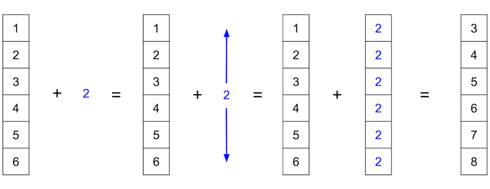
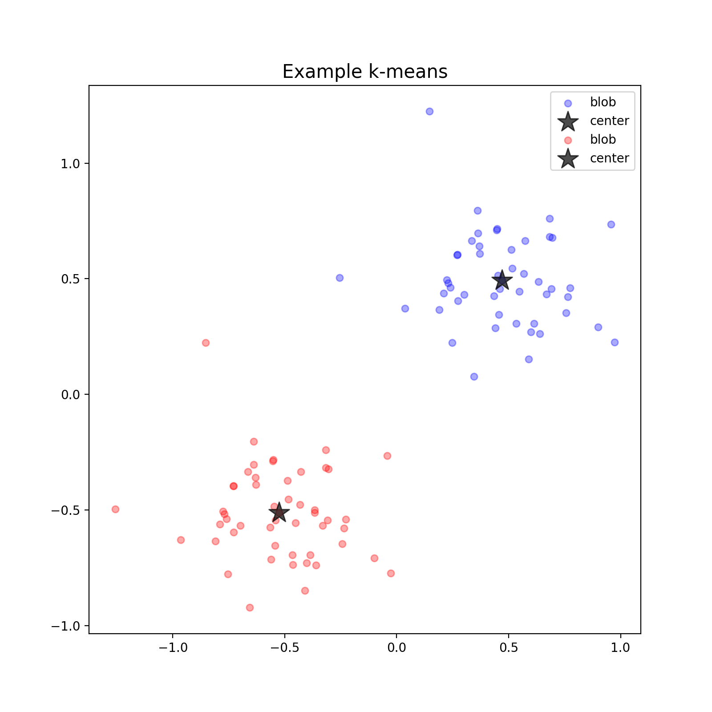

# An Introduction to Performant Python

This repository aims to serve as a tutorial style introduction to discovering numeric performance optimizations in the Python programming language. It assumes only a cursory knowledge of Python and a tolerance for pinches of math.

## Table of Contents:
1. [Preamble](#preamble)
2. [NumPy](#numpy)
    * [Duck Typing Limitations](#duck_limits)
    * [Broadcasting](#broadcasting)
3. [k-means](#kmeans)
    * [Why k-means?](#whyk)
    * [Pseudocode](#pseudo)
    * [Implementations](#implementations)
        1. [Base Python](#base_python)
        2. [NumPy Accelerated](#np_accel)
4. [Postmortem](#postmortem)

<a name="preamble">
## Preamble
</a>

Python is well known to be an incredible learning language for beginning programmers on account of its readability, intuitive syntax, and wonderful community.

What many people don't know about Python when they unknowingly choose it from a stack of languages based on what programming language the internet suggests a beginner start with is that Python has a vast array (no pun intended) of other amazing features, libraries, and applications; many more in fact than a beginner could even begin to guess.

A short, but far from exhaustive, list of fantastic Python offerings to whet your technical palate (**Note:** all of these libraries are open source):
* [Django](https://www.djangoproject.com/) - web development.
* [Selenium-Python](http://selenium-python.readthedocs.io/) - web browser automation.
* [SciPy](https://www.scipy.org/) - scientific computing.
* [Scikit-Learn](http://scikit-learn.org/stable/) - machine learning.
* [Tensorflow](https://www.tensorflow.org/) - tensor graph computation library from Google, nuff said.

It is through a specific library within the SciPy ecosystem that this tutorial will introduce programming performant Python. That library is [NumPy](http://www.numpy.org/).

<a name="numpy">
## NumPy 
</a>

NumPy's front page defines itself as the following:

> NumPy is the fundamental package for scientific computing with Python. It contains among other things:
> * a powerful N-dimensional array object
> * sophisticated (broadcasting) functions
> * tools for integrating C/C++ and Fortran code
> * useful linear algebra, Fourier transform, and random number capabilities

These are amazing features indeed if we're looking for a library to add some performance to our Python code.

As this repository intends simply to introduce NumPy we will be focusing on the first two bullet points, N-dimensional arrays and broadcasting functions. We should, however, take a moment to talk about some of the intuitions for when and why we can expect performance gains from NumPy; part of this is closely tied to Python's limitations.

<a name="duck_limits">
### Duck Typing Limitations
</a>

So we have some intuition for one of the reasons using NumPy might give us faster code let's discuss type systems for a moment.

Python is colloquially referred to a duck typed language, deriving from that phrase now known as the duck test, "If it looks like a duck, swims like a duck, and quacks like a duck, then it probably is a duck." You might be wondering, how in the world is this saying applicable to programming, aka, what's all this quack about? So let's get into that.

In Python, since it's an interpreted language, when you type the command `4 + 5` it doesn't __*know*__ what 4 and 5 are so it has to go check to see if you can add them together. As it turns out, you can, so Python with return `9`.

This going and checking if you can perform the requested operation in real time is part of what makes Python easy to program in. For example, if you want to do something in a `while` loop until a list, `ex_list`, is empty you could write `while len(ex_list) >= 0`. However, we can use duck typing to our advantage and instead write `while ex_list`. This works because Python knows `while` needs a boolean, so it will silently try to interpret `ex_list` as one; luckily a list only evaluates to `False` when it is empty, which is exactly what we want!

There is, however, a downside to duck typing. It incurs a time penalty, read: it can be slow sometimes. One of those times is when you're looping over numbers, and performing numeric operations on them. Even if you know you have a list only containing numbers, if you want to add 2 to every one of those numbers, you'll need to loop over the list and add 2 to every number; each time though, Python will need to manually check if it can add 2 to that element of the list. :'(

```python
>>> [i + 2 for i in [1, 2, 3, 4, 5, 6]]
[3, 4, 5, 6, 7, 8]
```

While much of the slowness in the above add 2 to all the elements of a list example can be attributed to duck typing pitfalls, we can see another aspect of the situation that is limiting is the nature of a Python list. Since Python lists are heterogeneous, this manual check for ability to add is actually necessary. Is there a different data structure, then, that could alleviate this pain point? I think you can guess where we're headed.

<a name="broadcasting">
### Broadcasting
</a>

NumPy is going to be our saving grace when it comes to escaping the time expensive processing of duck checking. But how is it going to do that? As we saw above in NumPy's self description, it provides "a powerful N-dimensional array object". By definition, at least in the C programming language which is the language Python and NumPy are written in, an array is an ordered, and therefore, indexable group of variables of the same type. This sounds just like a Python list, until we get to the part about having the same type. Another way to put it is that arrays are homogeneous.

It is this homogeneity that allows NumPy to run much faster that base Python. Consider the following intuitive extension of the above example of adding 2 to all the numbers in a list. If, instead, we use a NumPy array, the array will already know that all of it's elements are numbers, and so it won't need to check if it can add 2 to any of them.

In fact, in many situations, like the add 2 one above, we won't even need to write a loop to perform our operation! "How is possible?", you ask. Through the magic of the second feature of NumPy had listed above, [broadcasting](https://docs.scipy.org/doc/numpy/user/basics.broadcasting.html).

Broadcasting, also known as vectorization, provides a way to express operations over an entire array instead of having a manually loop over every individual element. Lets take a look a what this looks like with our add 2 example a picture then in code.

<div style="text-align: center"></div>

Basically all NumPy does when you try to add a single number to an array is infer that you want to add it to every element of the array. The really cool thing this that NumPy doesn't actually make an array full of 2's. Instead it actually performs the exact same loop we saw above, but it does it in C instead of Python.

We can see an equivalence of these two interpretations in the following code block. Note, the first one is actually faster because we don't have to move between copies of 2.

```python
>>> np.array([1, 2, 3, 4, 5, 6]) + 2
array([3, 4, 5, 6, 7, 8])
>>> np.array([1, 2, 3, 4, 5, 6]) + np.array([2, 2, 2, 2, 2, 2])
array([3, 4, 5, 6, 7, 8])
```

One final thing to note about broadcasting is that many of NumPy's functions, not just built-in operations can be broadcasted. We'll be seeing this and broadcasting in higher dimensions later in the tutorial. If you'd like to know more about broadcasting click to above like to NumPy's documentation on broadcasting.

That's all of the ex us look at an algorithm, k-means, to serve as a medium for observing a need for NumPy and then its power.

<a name="kmeans">
## k-means
</a>

[k-means](https://en.wikipedia.org/wiki/K-means_clustering) is an unsupervised machine learning algorithm designed to discover clusters within a dataset. Consider the following, highly math-less description, of k-means; algorithm/math/English junkies, please forgive me.

    Try to find the centers of blobs of that already "exist" within a dataset.

The following image, hopefully in the more intuitive visual way, demonstrates what is meant by "centers" and "blobs".

<div style="text-align: center"></div>

**Note:** In practice these "blobs" exist in a space with many more than two dimensions. The above plot is presented solely as a device to gain intuition for what we're trying to accomplish with k-means.

<a name="whyk">
### Why k-means?
</a>

It's worth mentioning that k-means is a great algorithm to introduce numeric Python optimizations with since it is both fairly straightforward and has a visually demonstrable result. In addition, it's simplest implementation isn't overly complicated in either base Python or with NumPy.

In order to stay on the rails and keep chugging towards learning about injecting performance into Python and not detour deep into machine learning algorithms...ville, let's move on to pseudocode and then implementations of the k-means algorithm.

<a name="pseudo">
### Pseudocode
</a>

For some context of how k-mean finds the "center" of the "blobs" here's a rough pseudocode outline of the algorithm.

1. Initialize centroids. Aka, choose `k` centroids to start from.
2. While stopping condition not met:
    1. Find closest centroid to each point.
    2. Move centroids to the average of all the points closest to them.

<a name="implementations">
### Implementations
</a>

**Note:** The code blocks throughout the remainder of this tutorial will not include doc strings to cut down on unnecessary space usage. In addition, code blocks will be accompanied by descriptions of the code. However, doc strings are important! As such, they are obviously included in the actual scripts.

First we're going to to look at a k-means implementation using only built-in Python functions and data types.

<a name="base_python">
#### Base Python
</a>

This k-means implementation lives under the name `base_python` in the `kmeans.py` script in the `src` directory. At the top level, we see the code outline of the pseudocode above. The `k` centroids are initialized to the first `k` data points, and the stopping condition is set to be a fixed number of iterations. **Note:** There are better ways to do both of these things, the method here was chosen to boil the algorithm to it's simplest form.

```python
def base_python(X, k, iterations=1000):
    centroids = X[:k]
    for _ in range(iterations):
        centroid_assignments = get_new_assignments(centroids, X)
        centroids = calculate_new_centroids(centroid_assignments)
    return centroids, centroid_assignments
```

The meat of `base_python`, however, is implemented in two functions: `get_new_assignments` and `calculate_new_centroids` corresponding to steps 2.1 and 2.2, respectively, in the pseudocode above. Let's look at both now.

##### Getting New Centroid Assignments

```python
def get_new_assignments(centroids, X):
    centroid_assignments = [[] for _ in centroids] # <------------------------ Part 1
    for data_point in X: # <-------------------------------------------------- Part 2
        closest_dist = 1e100
        closest_centroid = None
        for centroid_idx, centroid_location in enumerate(centroids): # <------ Part 3
            current_dist = list_euclidean_dist(centroid_location, data_point)
            if current_dist < closest_dist:
                closest_dist = current_dist
                closest_centroid = centroid_idx
        centroid_assignments[closest_centroid].append(data_point)
    return centroid_assignments
```

The above function, which finds the closest centroid to each data point given the current centroids and all of the data, has 3 main parts, following are their explanations:

1. initialization of the centroid assignments list,
2. a loop over all the data points,
3. a nested loop over all the centroids.

The first part makes an empty list of lists. Corresponding by index, each of these inner lists will hold the data points that make up a centroids "blob".

The second part initializes variables `closest_dist` and `closest_centroid` to be updated by the inner loop discussed in part three. Once the inner loop is complete and the closest centroid discovered for a data point, that data point is appended to the list in `centroid_assignments` corresponding to it's closest centroid.

The third part loops over all of the centroids updating the closest one if the current centroids distance is less than the closest centroid it's seen so far. To calculate distance it uses the function `list_euclidean_dist`. Here is its code:

```python
def list_euclidean_dist(a, b):
    return sum((da - db) ** 2 for da, db in zip(a, b)) ** 0.5
```

##### Finding New Centroids

```python
def calculate_new_centroids(centroid_assignments):
    new_centroids = [] # <---------------------------------------------------- Part 1
    for centroid_assignment in centroid_assignments: # <---------------------- Part 2
        centroid = [] # <----------------------------------------------------- Part 3
        for dim in zip(*centroid_assignment): # <----------------------------- Part 4
            centroid.append(sum(dim) / len(dim))
        new_centroids.append(centroid) 
    return new_centroids
```

This function which takes the output of `get_new_assignments`, a list of lists of data points closest to that centroid, one for each centroid, also has three main parts:

1. initialize a new list to hold all the new centroids to be calculated,
2. a loop over all the centroid assignment lists,
3. initialize a new list to hold the values of a single new centroid,
4. a nested loop over the dimensions of the data points, finding the average value for each.

Parts 1, 2, and 3 are pretty self-explanatory; part 4, though has some slightly shifty things going on. Much of this shiftiness happens in the `for dim in zip(*centroid_assignment)`. In case you haven't encountered it before, the `*` before an iterable "unpacks" it. What this means is that all the lists, here data points, in `centroid_assignment` are pulled apart; when they are immediately zipped back together all of the first elements of the original lists are grouped together, then the second ones, etc.

Let's look at a toy example so we can "see" what's going on:

```python
>>> centroid_assignment = [[1, 2], [3, 4], [5, 6]]
# => *centroid_assignment looks like [1, 2] [3, 4] [5, 6] as separate entities
>>> zip(*centroid_assignment)
[(1, 3, 5), (2, 4, 6)]
```

Given this, our for loop is looping over the dimensions of the data points, getting all the values for each dimension of the data points closest to that centroid, one at a time. Once we have this, to find the average value in this dimension we simply sum the values and divide by the number of them.

<a name="np_accel">
### NumPy Accelerated
</a>

The NumPy version of this algorithm is going to take advantage of broadcasting to speed things up. The broadcasting used is slightly more advanced than the example above, but each place it's used the intuition behind what's going on will be explained.

As for the k-mean algorithm, the NumPy version still follows the outline laid out in the pseudocode above. Here it is again so you don't have to scroll back up.

1. Initialize centroids. Aka, choose `k` centroids to start from.
2. While stopping condition not met:
    1. Find closest centroid to each point.
    2. Move centroids to the average of all the points closest to them.

Another benefit of broadcasting is that is going to lead to shorter code as we won't be writing out explicit for loops. With that in mind, here is the entirety of the k-means algorithm with NumPy.

```python
import numpy as np
from scipy.spatial.distance import cdist

def numpy(X, k, iterations=1000):
    centroids = X[:k] # <----------------------------------------------------- Part 1
    for _ in range(iterations): # <------------------------------------------- Part 2
        closest_centroid_idxs = cdist(X, centroids).argmin(axis=1) # <-------- Part 2.1
        centroids = np.zeros(shape=(k, X.shape[1]))
        for idx in range(k): # <---------------------------------------------- Part 2.2
            centroids[idx] = np.mean(X[closest_centroid_idxs == idx])

    centroid_assignments = make_centroid_assignments(X, closest_centroid_idxs)
    return centroids, centroid_assignments

def make_centroid_assignments(X, closest_idxs):
    return [X[closest_idxs == idx] for idx in np.unique(closest_idxs)]
```

<a name="postmortem">
## Postmortem
</a>

**Talk about the high level intuition of why nuumpy sped things up for kmeans (c level speed by removing duck checks) and begin to talk about other optimization that we can get from numpy (linear algebra stuff, calling down to c and fortran, revisit numpy's self description**
